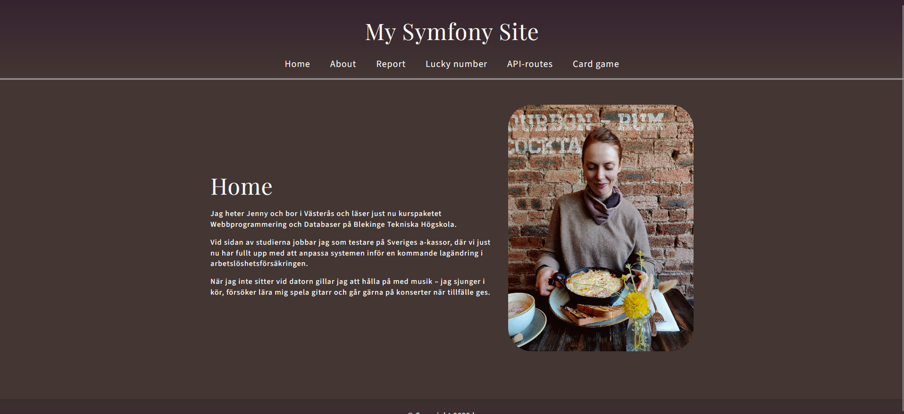

# Report - Mina inlämningsuppgifter i MVC

[](https://scrutinizer-ci.com/g/busigbil/MVC2025/?branch=main)
[](https://scrutinizer-ci.com/g/busigbil/MVC2025/?branch=main)
[](https://scrutinizer-ci.com/g/busigbil/MVC2025/build-status/main)
[](https://scrutinizer-ci.com/code-intelligence)



Kursen i Model-View-Controller (MVC) vid Blekinge Tekniska Högskola ger studenter en djupgående förståelse för MVC-arkitekturen, en central designprincip inom modern webb- och applikationsutveckling.

Detta är mitt kursrepo med inlämningsuppgifter i kursen MVC.

## Instruktioner
Instruktion för att komma igång med webbplatsen.

### 1. Installera nödvändiga verktyg:
PHP och Composer behöver vara tillgängliga via terminalen. Här finns [en guide på dbwebb-webbplatsen](https://dbwebb.se/kurser/mvc-v2/labbmiljo/php-composer) om hur PHP och Composer installeras.

För att verifiera versionen kan man använda --version:

```bash
$ php --version
PHP 8.3.4 (cli) (built: Mar 16 2024 08:40:08) (NTS)

$ composer --version
Composer version 2.4.1 2022-08-20 11:44:50
```

### 2. Klona repot:
Skriv in länken till detta repo i terminalen:

```bash
git clone https://github.com/busigbil/MVC2025.git
cd MVC2025
```

### 3. Kör applikationen i webbläsaren:
Använd PHPs inbyggda webbserver för att köra applikationen i webbläsaren.

```bash
# Stå i MVC2025 katalogen
php -S localhost:8888 -t public
```
